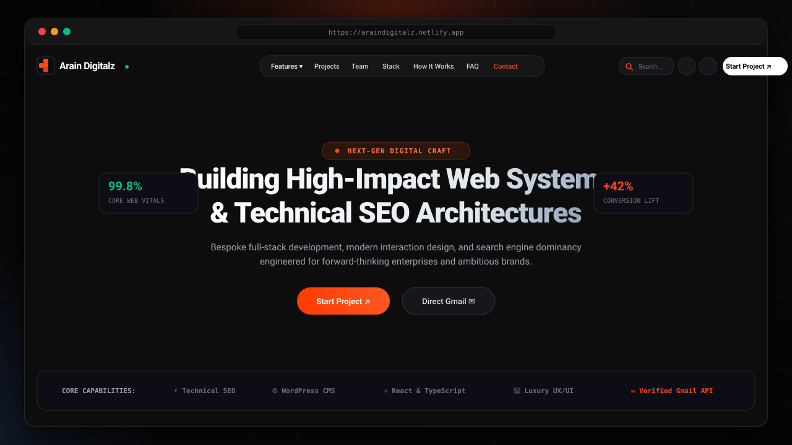
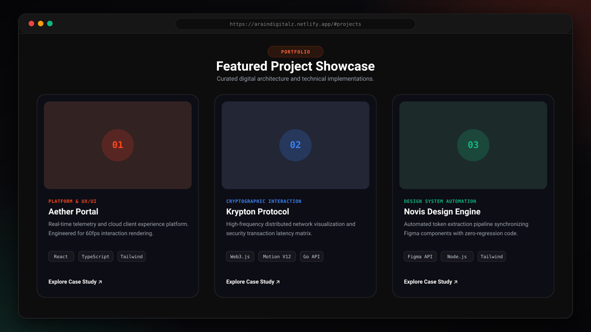
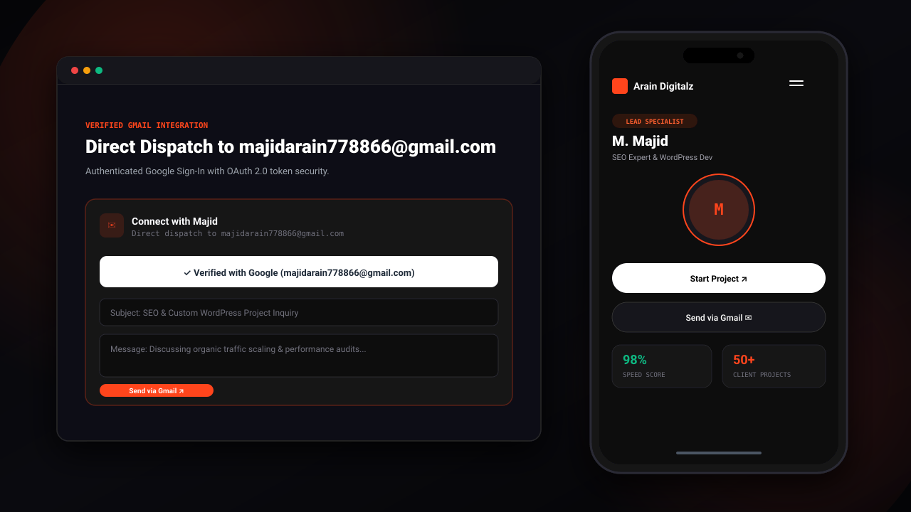

<div align="center">

# ⚡ Arain Digitalz
### Elite Digital Agency Portfolio, Interactive Architecture & Technical SEO

[](https://app.netlify.com)
[](https://react.dev/)
[](https://www.typescriptlang.org/)
[](https://vitejs.dev/)
[](https://tailwindcss.com/)
[](LICENSE)

A high-performance, dark-luxury digital agency portfolio and technical showcase engineered for **M. Majid (Lead Technical SEO Specialist & WordPress Developer)**. Features procedural audio cues, verified Google Workspace Gmail dispatch, interactive Web3/UX project case studies, and 60fps animations.

[Explore Features](#-key-features) • [Deploy to Netlify](#-netlify-deployment-guide) • [Local Setup](#-local-development) • [Architecture](#-project-structure)

</div>

---

## 📸 Website Showcase

### 1. Desktop Experience & Centered Navigation Capsule


### 2. Featured Projects & Technical Architecture


### 3. Responsive Mobile View & Verified Gmail Integration


---

## ✨ Key Features

* **Mathematical 3-Column Header**:
  * **Left**: Vector geometric brand logo and status indicators (`flex-1 basis-0`).
  * **Center**: Symmetrically locked navigation capsule (`Features ▾`, `Projects`, `Team`, `Stack`, `How It Works`, `Testimonials`, `FAQ`, `Contact`).
  * **Right**: Real-time section search with `Cmd+K` keyboard shortcut, procedural sound toggle, theme switcher, Facebook-style progress simulator, and primary CTA.
  * **Adaptive Breakpoints**: Compact desktop (`1024px – 1279px`) tucks secondary links into an interactive **`More ▾`** dropdown to guarantee zero horizontal squeeze or overflow.

* **Verified Google Workspace Gmail Integration**:
  * Visitors can sign in via standard Google OAuth 2.0 to send verified emails directly to **`majidarain778866@gmail.com`**.
  * Pre-fills sender identity with verified Google Profile badges.
  * Mandatory pre-flight confirmation dialog to prevent accidental transmissions.
  * Uses the official Gmail REST API (`/gmail/v1/users/me/messages/send`) with Base64URL RFC 2822 payload encoding and instant message ID delivery receipts.

* **Procedural Web Audio Engine**:
  * Built directly on the native browser **Web Audio API** (`SoundContext.tsx`).
  * Synthesizes soft, organic micro-haptics (wood clicks, double slides, ascending victory chords) with zero external audio assets or network latency.
  * One-click mute/unmute control saved in `localStorage`.

* **Production-Grade SEO & Discoverability**:
  * Full Open Graph metadata and Twitter Summary cards for social sharing.
  * Automatic crawler indexation with `robots.txt` and `sitemap.xml`.
  * Inline SVG favicon matching the brand mark to eliminate browser 404s.

* **Interactive Sections & Conversion Modules**:
  * **Hero Showreel**: Video background with ambient lighting and dual-tier CTAs.
  * **Lead Specialist Profile**: Spotlight on M. Majid (SEO Audits, WordPress Architecture, Core Web Vitals).
  * **Interactive Case Studies**: Dynamic project cards featuring tech stack badges and metric highlights.
  * **Skills Matrix**: Visual representation of core frameworks and tooling utilization rates.
  * **Client Testimonials**: Interactive carousel with play/pause and navigation controls.
  * **Interactive FAQ**: Fluid accordion addressing timelines, design-to-code workflows, and guarantees.
  * **Quick Feedback Drawer & WhatsApp Quick Connect**: Floating persistent contact mechanisms for frictionless lead generation.

---

## 🚀 Netlify Deployment Guide

This repository has been fully audited and configured for instant Netlify deployment.

### Method 1: Git Integration (Recommended)

1. Push this repository to your **GitHub**, **GitLab**, or **Bitbucket** account.
2. Log in to [Netlify](https://app.netlify.com) and click **"Add new site" > "Import an existing project"**.
3. Select your repository.
4. Netlify will automatically detect `netlify.toml` and configure the build settings:
   * **Build command**: `npm run build`
   * **Publish directory**: `dist`
5. Click **"Deploy site"**. Your website will be live in under 60 seconds!

### Method 2: Netlify CLI

You can also deploy directly from your local terminal using the Netlify CLI:

```bash
# Install Netlify CLI globally
npm install -g netlify-cli

# Login to your Netlify account
netlify login

# Initialize and link site
netlify init

# Deploy directly to production
netlify deploy --prod
```

### Netlify Configuration Reference (`netlify.toml`)

The included `netlify.toml` automatically handles single-page routing, asset caching, and security headers:

```toml
[build]
  command = "npm run build"
  publish = "dist"

# SPA Fallback: Direct all routes to index.html with HTTP 200
[[redirects]]
  from = "/*"
  to = "/index.html"
  status = 200

# Security and caching headers
[[headers]]
  for = "/*"
  [headers.values]
    X-Frame-Options = "DENY"
    X-Content-Type-Options = "nosniff"
    Referrer-Policy = "strict-origin-when-cross-origin"
    Permissions-Policy = "camera=(), microphone=(), geolocation=()"

# Long-term immutable caching for Vite hashed assets
[[headers]]
  for = "/assets/*"
  [headers.values]
    Cache-Control = "public, max-age=31536000, immutable"

# Static images caching
[[headers]]
  for = "/images/*"
  [headers.values]
    Cache-Control = "public, max-age=604800, stale-while-revalidate=86400"
```

---

## 🛠 Local Development

### Prerequisites

* Node.js `18.x` or `20.x`+
* `npm`, `pnpm`, or `bun`

### Setup Steps

1. **Clone the repository:**
   ```bash
   git clone https://github.com/majidarain778866-ui/arain-digitalz.git
   cd arain-digitalz
   ```

2. **Install dependencies:**
   ```bash
   npm install
   ```

3. **Start the local development server:**
   ```bash
   npm run dev
   ```
   Open [http://localhost:3000](http://localhost:3000) in your browser.

4. **Verify TypeScript & linting:**
   ```bash
   npm run lint
   ```

5. **Build for production:**
   ```bash
   npm run build
   ```

6. **Preview the production build locally:**
   ```bash
   npm run preview
   ```

---

## 📁 Project Structure

```text
├── public/
│   ├── _redirects              # Netlify SPA fallback routing
│   ├── favicon.svg             # Vector brand mark favicon
│   ├── robots.txt              # Search engine crawler permissions
│   ├── sitemap.xml             # XML sitemap for SEO indexation
│   ├── images/                 # Optimized profile & setting assets
│   └── screenshots/            # High-fidelity SVG visual previews
│       ├── desktop-hero.svg
│       ├── projects-showcase.svg
│       └── mobile-responsive.svg
├── src/
│   ├── components/             # Reusable UI modules
│   │   ├── BackToTop.tsx
│   │   ├── ContactModal.tsx    # Google OAuth & Gmail API dispatch
│   │   ├── CustomCursor.tsx
│   │   ├── FAQSection.tsx
│   │   ├── FeaturedProjects.tsx
│   │   ├── Header.tsx          # Responsive 3-column centered navigation
│   │   ├── MagneticButton.tsx
│   │   ├── Newsletter.tsx
│   │   ├── QuickFeedbackDrawer.tsx
│   │   ├── SearchSections.tsx  # Cmd+K live section search
│   │   ├── SitemapFooter.tsx
│   │   ├── SmoothLoader.tsx
│   │   ├── TeamSection.tsx     # Lead specialist profile & credentials
│   │   ├── TechStack.tsx
│   │   ├── Testimonials.tsx
│   │   └── WhatsAppFloatingButton.tsx
│   ├── context/
│   │   └── SoundContext.tsx    # Web Audio API sound synthesis
│   ├── services/
│   │   ├── gmailApi.ts         # RFC 2822 formatting & Gmail REST API
│   │   └── gmailAuth.ts        # Firebase Auth & Google OAuth token handling
│   ├── App.tsx                 # Main single-page application orchestrator
│   ├── index.css               # Tailwind CSS v4 styling rules
│   ├── main.tsx                # React DOM root entry
│   └── vite-env.d.ts           # Vite client environment typing
├── firebase-applet-config.json # Firebase client configuration
├── netlify.toml                # Netlify build, redirects & security headers
├── package.json                # Project dependencies and build scripts
├── tsconfig.json               # TypeScript configuration
└── vite.config.ts              # Vite plugins and module aliases
```

---

## 🔒 Security & Environment Variables

* **No Server Secrets in Client Code**: All frontend bundles are built without sensitive private keys.
* **Google Workspace OAuth 2.0**: Gmail API tokens are retrieved in-memory via Google Popup Authentication and are never stored in `localStorage` or `sessionStorage`.
* **Optional Environment Overrides**: The application reads `firebase-applet-config.json` by default, but also supports optional Netlify dashboard environment variables:
  * `VITE_FIREBASE_API_KEY`
  * `VITE_FIREBASE_AUTH_DOMAIN`
  * `VITE_FIREBASE_PROJECT_ID`
  * `VITE_FIREBASE_STORAGE_BUCKET`
  * `VITE_FIREBASE_MESSAGING_SENDER_ID`
  * `VITE_FIREBASE_APP_ID`

---

## 👨‍💻 Author & Contact

**M. Majid** — Lead Technical SEO Specialist & WordPress Architect

* **Email**: [majidarain778866@gmail.com](mailto:majidarain778866@gmail.com)
* **WhatsApp**: [+92 329 4947812](https://wa.me/923294947812)
* **LinkedIn**: [majid-arain-bb6a03393](https://www.linkedin.com/in/majid-arain-bb6a03393/)
* **GitHub**: [@majidarain778866-ui](https://github.com/majidarain778866-ui)
* **Facebook**: [All-In-One Digital Solutions](https://www.facebook.com/people/All-In-One-Digital-Solutions/61576383253081/)
* **Twitter / X**: [@ArainD41848](https://x.com/ArainD41848)

---

## 📄 License

This project is licensed under the [MIT License](LICENSE).
